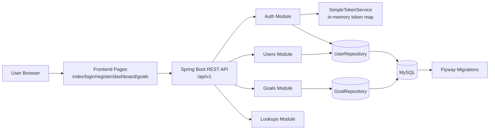

# System Architecture

## Selected Stack and Justification

This project uses a **Spring Boot + MySQL + Vanilla JS multi-page client** stack.

Why this stack was selected:
- Fast to deliver for Phase 1 with minimal setup complexity.
- Strong backend structure (Controller -> Service -> Repository) suitable for scale.
- Relational data (users/goals) fits MySQL + JPA very well.
- Flyway migrations provide schema version control from day 1.
- Vanilla JS reduces build-tool overhead for academic/demo review timelines.

Alternative full-stack options (MERN/PERN/etc.) are valid, but this stack was chosen for cleaner Java backend layering, strong type-safe domain modeling, and predictable SQL schema evolution.

## High-Level Components
- **Frontend**: Multi-page HTML/CSS/JS UI
- **API Layer**: Spring Boot REST controllers under `/api/v1/*`
- **Business Layer**: Service classes for auth, users, goals
- **Data Layer**: Spring Data JPA repositories
- **Database**: MySQL (`users`, `goals`) with Flyway migrations

## System Flow Diagram

## Request Lifecycle (Protected APIs)
1. User authenticates via `POST /api/v1/auth/login` or `register`.
2. Backend returns token and user id.
3. Frontend stores token in `localStorage`.
4. Protected requests include `X-Auth-Token` header.
5. `SimpleTokenService` resolves user identity.
6. Service layer executes logic and repository reads/writes MySQL.
7. API returns standard `ApiResponse<T>` payload.

## Frontend Interaction Flow
1. Register page loads `roles` and `career-tracks` from lookup APIs.
2. Dashboard fetches profile + goals + goal templates in parallel.
3. Goals page handles create/update/delete + search/filter.
4. Template actions pre-fill goal creation fields for faster planning.

## Non-Functional Notes
- CORS configured in backend (`WebConfig`) for frontend origin usage.
- Validation handled through `jakarta.validation` annotations in DTOs.
- Passwords hashed with BCrypt before persistence.
